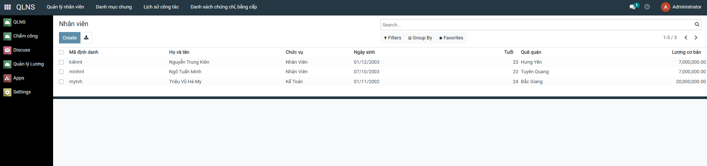
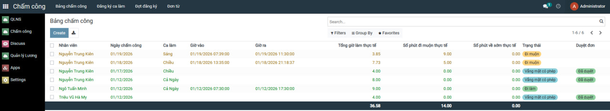
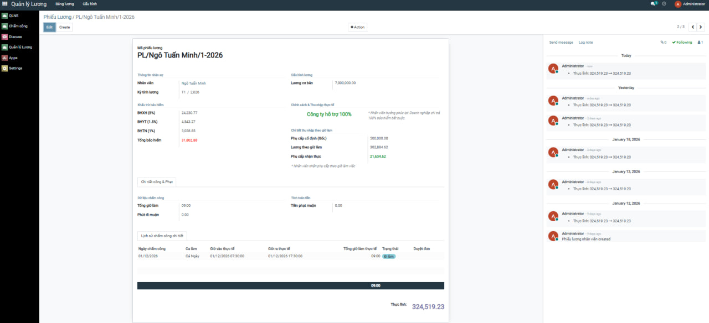
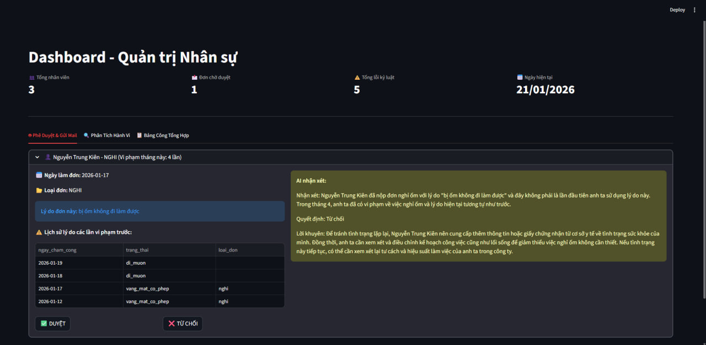

<h1 align="center">
THỰC TẬP CNTT7: THỰC TẬP DOANH NGHIỆP - QUẢN LÝ CHẤM CÔNG VÀ TÍNH LƯƠNG
</h1>
<div align="center">
  
  
  
</div>
<br>
<div align="center">

[](https://fitdnu.net/)
[](https://dainam.edu.vn/vi)

</div>

<div align="center">

[](https://www.w3.org/XML/)
[](https://www.odoo.com/)


[](https://github.com/PyCQA/bandit)

</div>

<hr>

<div align="center">

# 🏢 Giới thiệu hệ thống

</div>

### 📖 Hệ thống được xây dựng trên nền tảng **Odoo ERP** nhằm tối ưu hóa toàn diện quy trình quản trị nhân sự, chấm công và tự động hóa bảng lương cho tổ chức. Giải pháp kết hợp sức mạnh của phân tích dữ liệu và **Trí tuệ nhân tạo (AI)** để giải quyết bài toán minh bạch trong kỷ luật lao động và chính xác trong hạch toán chi phí.

### 🌟 Các tính năng cốt lõi:
* **Quản trị Chấm công Đa chiều:** Tự động ghi nhận ngày công, phân tích chi tiết số phút đi muộn/về sớm và quản lý trạng thái vắng mặt theo thời gian thực.
* **Phê duyệt Đơn từ Thông minh (AI Insight):** Sử dụng AI để thẩm định tính trung thực của các đơn xin nghỉ dựa trên việc đối chiếu lịch sử vi phạm và quy luật hành vi của nhân sự.
* **Dashboard Phân tích Hành vi:** Trực quan hóa các "lý do quốc dân" phổ biến và soi quy luật vi phạm theo thứ trong tuần để hỗ trợ quản lý ra quyết định chiến lược.
* **Tự động hóa Tính lương:** Kết xuất bảng lương chuẩn xác từ dữ liệu chấm công thực tế, giúp loại bỏ sai sót thủ công và đảm bảo quyền lợi cho người lao động.
* **Hệ thống Thông báo & Tương tác:** Tích hợp gửi thông báo kết quả phê duyệt và phiếu lương tự động qua Email, tối ưu hóa trải nghiệm nhân viên trong tổ chức.


<hr>

# 1. Cài đặt công cụ, môi trường và các thư viện cần thiết

## 1.1. Clone project.
git clone https://gitlab.com/anhlta/odoo-fitdnu.git
git checkout 

## 1.2. cài đặt các thư viện cần thiết

Người sử dụng thực thi các lệnh sau đề cài đặt các thư viện cần thiết

```
sudo apt-get install libxml2-dev libxslt-dev libldap2-dev libsasl2-dev libssl-dev python3.10-distutils python3.10-dev build-essential libssl-dev libffi-dev zlib1g-dev python3.10-venv libpq-dev
```
## 1.3. khởi tạo môi trường ảo.

`python3.10 -m venv ./venv`
Thay đổi trình thông dịch sang môi trường ảo và chạy requirements.txt để cài đặt tiếp các thư viện được yêu cầu

```
source venv/bin/activate
pip3 install -r requirements.txt
```

# 2. Setup database

Khởi tạo database trên docker bằng việc thực thi file dockercompose.yml.

`docker-compose up -d`

# 3. Setup tham số chạy cho hệ thống

## 3.1. Khởi tạo odoo.conf

Tạo tệp **odoo.conf** có nội dung như sau:

```
[options]
addons_path = addons
db_host = localhost
db_password = odoo
db_user = odoo
db_port = 5432
xmlrpc_port = 8069
```
Có thể kế thừa từ **odoo.conf.template**

Ngoài ra có thể thêm mổ số parameters như:

```
-c _<đường dẫn đến tệp odoo.conf>_
-u _<tên addons>_ giúp cập nhật addons đó trước khi khởi chạy
-d _<tên database>_ giúp chỉ rõ tên database được sử dụng
--dev=all giúp bật chế độ nhà phát triển 
```

# 4. Chạy hệ thống và cài đặt các ứng dụng cần thiết

Người sử dụng truy cập theo đường dẫn _http://localhost:8069/_ để đăng nhập vào hệ thống.

# 5. Khởi chạy Dashboard AI (Streamlit)
```
streamlit run dashboard_app.py chạy lệnh để khởi động Dashboard
```
<hr>

# 🚀 2. GIAO DIỆN CÁC CHỨC NĂNG
### Giao diện nhân sự


### Giao diện chấm công


### Giao diện tính lương


### Giao diện Dashboard AI


<hr>

<h2 align="center">🤝</h2>
<p>Dự án được phát triển bởi:</p>
<center>
<table>
  <thead>
    <tr>
      <th>Giảng viên hướng dẫn</th>
    </tr>
  </thead>
  <tbody>
    <tr>
      <td>Thầy Lê Tuấn Anh</td>
    </tr>
  </tbody>
</table>
</center>

<center>
<p>Sinh viên thực hiện:</p>
<table>
  <thead>
    <tr>
      <th>Họ và Tên</th>
      <th>Mã sinh viên</th>
      <th>Vai trò</th>
    </tr>
  </thead>
  <tbody>
    <tr>
      <td>Ngô Tuấn Minh</td>
      <td>1571020175</td>
      <td>Phát triển dự án</td>
    </tr>
    <tr>
      <td>Triệu Vũ Hà My</td>
      <td>1571020181</td>
      <td>Phát triển dự án</td>
    </tr>
    <tr>
      <td>Nguyễn Trung Kiên</td>
      <td>1671020172</td>
      <td>Phát triển dự án</td>
    </tr>
  </tbody>
</table>
</center>

<p align="center">© 2026 NGÔ TUẤN MINH, CNTT16-06, TRƯỜNG ĐẠI HỌC ĐẠI NAM</p>
